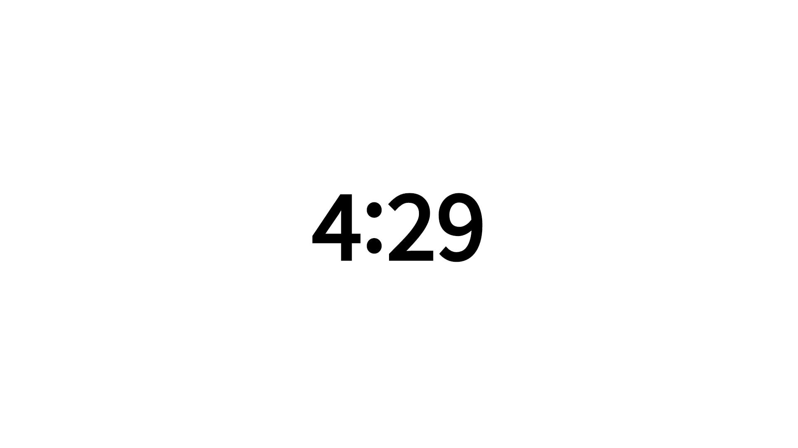
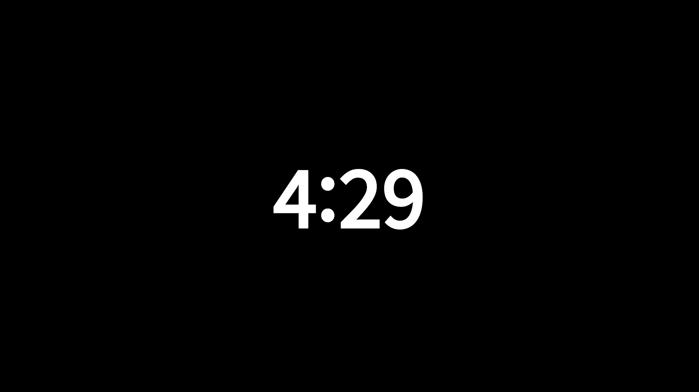
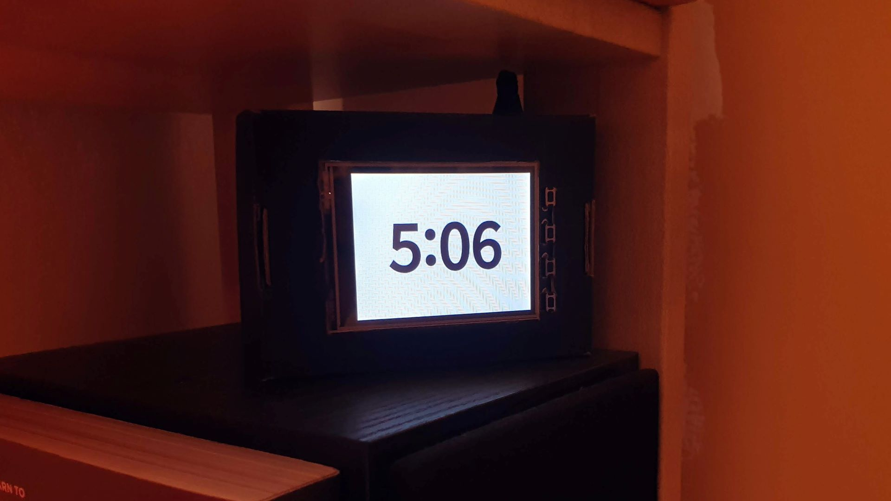

# ⏱ RescueTime-Screen
A Flask app that queries RescueTime data and calculates daily screen time to create a screen with a running total. It queries RescueTime every minute.

## Screenshots
Light Mode             |  Dark Mode            | Example usage
:---------------------:|:---------------------:|:-------------------------:
  |   | 
## Prerequisites
- Python 3.6 or above 🐍
- Pip package manager 📦
- A RescueTime account (free or premium)
## Installation 💿
1. [Clone](https://github.com/profwyattb/RescueTime-Screen/archive/master.zip) this repository
1. Go to [RescueTime](https://www.rescuetime.com/anapi/manage) and create a new key
1. Edit app.py and paste the key where indicated
1. Run `pip3 install -r requirements.txt`
## Usage 🛠
1. To start the flask server, run `python3 app.py`
